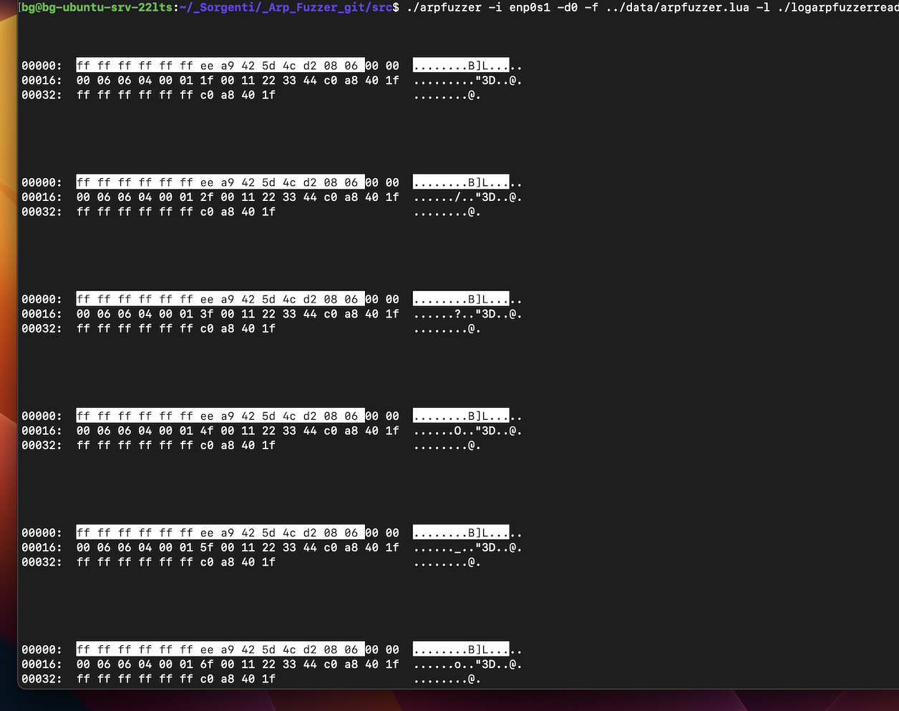

Description:
============

Arpfuzzer is a program able to send arbitrary ARP packets using a LUA engine. In other words, using a LUA script executed by the embedded LUA engine, you can implement whatever ARP packet configuration or sequence of packets, exploiting the LUA basic syntax (conditions, loops, etc). That permits to implement custom pentests logic, fuzzing, well-known ARP based attacks ( flooding, poisoning, etc). 

Disclaimers:
============

* This program is intended to be used on a controlled / legit environment, a careless use can ( and will ) create serious malfunctions in network communications.

* Before using this program you should be familiar with ARP protocol (RFC 826).


Prerequisites:
==============

The program is intended to be used in a Linux environment and it is tested using the following Linux distributions:

- Ubuntu 22.04.2 LTS (jammy) for ARM<BR>
- Ubuntu 22.04.2 LTS (jammy) for x86-64<BR>

using, as compiler, one in this list:<BR>

- g++ (Ubuntu 11.3.0-1ubuntu1~22.04.1) 11.3.0  (ARM)<BR>
- g++ (Ubuntu 11.3.0-1ubuntu1~22.04.1) 11.3.0  (x86-64)<BR>

To compile the program, this tools/libraries are necessary:

* a c++ compiler ( with c++20 support);
* automake/autoconf with libtool;
* libcap (Capabilities lib), example for Ubuntu/Debian:
```
  sudo apt install  libcap-dev
```
* liblua , example for Ubuntu/Debian:
```
  sudo apt install liblua5.4-dev
```

Installation:
=============

- Create config scripts:
```
   make -f makefile.dist
```
- launch the configure script:
```
  ./configure
```
- Compile the program:
```
  make
```
- Install the program and the man page:
```
  sudo make install
```

* set manually the capabilities ( superflous if you do 'make install' ):
```
  sudo setcap cap_net_raw=eip src/arpfuzzer   
```

Configuration:
==============

* Configuration and LUA script templates are provided in "data" directory;
* To avoid gargage printed on the chat conversation panel, set accordigly the filter in configuration file.
* This ia a configuration example:
```
--[[ Flag:           hdrSenderMAC
     Type:           string reprenenting uint8_t 6 element array 
     Synopsis:       Set value for sender MAC address in header
     Valid values:   --
--]]
hdrSenderMAC = "0xEE:0xA9:0x42:0x5D:0x4C:0xD2"

--[[ Flag:           hdrTargetMAC
     Type:           string reprenenting uint8_t 6 element array 
     Synopsis:       Set value for target MAC address in header
     Valid values:   --
--]]
hdrTargetMAC = "0xFF:0xFF:0xFF:0xFF:0xFF:0xFF"

--[[ Flag:           frameType
     Type:           uint16_t integer 
     Synopsis:       Set value for frame type
     Valid values:   --
--]]
frameType = 0x806

--[[ Flag:           hardType
     Type:           uint16_t integer 
     Synopsis:       Set value for hardware type
     Valid values:   --
--]]
hardType = 0x0

--[[ Flag:           protType
     Type:           uint16_t integer 
     Synopsis:       Set value for protocol type
     Valid values:   --
--]]
protType = 0x0

--[[ Flag:           hardSize
     Type:           uint8_t integer 
     Synopsis:       Set value for hardware size
     Valid values:   --
--]]
hardSize = 0x6

--[[ Flag:           protSize
     Type:           uint8_t integer 
     Synopsis:       Set value for protocol size
     Valid values:   --
--]]
protSize = 0x4

--[[ Flag:           opcode
     Type:           uint16_t integer 
     Synopsis:       Set value for opcode
     Valid values:   --
--]]
opcode = 0x1

--[[ Flag:           senderMAC
     Type:           string reprenenting uint8_t 6 element array 
     Synopsis:       Set value for sender MAC address
     Valid values:   --
--]]
senderMAC = "0xFF:0xFF:0xFF:0xFF:0xFF:0xFF"

--[[ Flag:           targetMAC
     Type:           string reprenenting uint8_t 6 element array 
     Synopsis:       Set value for targer MAC address
     Valid values:   --
--]]
targetMAC = "0xFF:0xFF:0xFF:0xFF:0xFF:0xFF"

--[[ Flag:           senderIp
     Type:           string reprenenting uint8_t 4 element array 
     Synopsis:       Set value for sender IP address
     Valid values:   --
--]]
senderIp = "192.168.64.31"


--[[ Flag:           targetIp
     Type:           string reprenenting uint8_t 4 element array 
     Synopsis:       Set value for targer IP address
     Valid values:   --
--]]
targetIp = "192.168.64.31"


--[[ Flag:           frameTypeFilter
     Type:           uint16_t integer 
     Synopsis:       Set a filter allowing only packets with this value as frame type
     Valid values:   --
--]]
frameTypeFilter = 0x806

--[[ Flag:           hardTypeFilter
     Type:           uint16_t integer 
     Synopsis:       Set a filter allowing only packets with this value as hard type
     Valid values:   --
--]]
-- hardTypeFilter = 0x0

--[[ Flag:           protTypeFilter
     Type:           uint16_t integer 
     Synopsis:       Set a filter allowing only packets with this value as protocol type
     Valid values:   --
--]]
-- protTypeFilter = 0x0

--[[ Flag:           hardSizeFilter
     Type:           uint8_t integer 
     Synopsis:       Set a filter allowing only packets with this value as hard size
     Valid values:   --
--]]
-- hardSizeFilter = 0x0

--[[ Flag:           protSizeFilter
     Type:           uint8_t integer 
     Synopsis:       Set a filter allowing only packets with this value as protocol size
     Valid values:   --
--]]
-- protSizeFilter = 0x0

--[[ Flag:           opcodeFilter
     Type:           uint16_t integer 
     Synopsis:       Set a filter allowing only packets with this value as opcode
     Valid values:   --
--]]
opcodeFilter = 0x1

--[[ Flag:           senderMACFilter
     Type:           string reprenenting uint8_t 6 element array 
     Synopsis:       Set a filter allowing only packets with this value as sender MAC address
     Valid values:   --
--]]
-- senderMACFilter = "0xEE:0xA9:0x42:0x5D:0x4C:0xD2"

--[[ Flag:           senderIpFilter
     Type:           string reprenenting uint8_t 4 element array 
     Synopsis:       Set a filter allowing only packets with this value as sender IP address
     Valid values:   --
--]]
senderIpFilter = "192.168.64.31"


--[[ Flag:           targetMACFilter
     Type:           string reprenenting uint8_t 6 element array 
     Synopsis:       Set a filter allowing only packets with this value as target MAC address
     Valid values:   --
--]]
-- targetMACFilter = "0x0:0x0:0x0:0x0:0x0:0x0"

--[[ Flag:           targetIpFilter
     Type:           string reprenenting uint8_t 4 element array 
     Synopsis:       Set a filter allowing only packets with this value as sender IP address
     Valid values:   --
--]]
-- targetIpFilter = "0.0.0.0"
```


Examples:
=========

* The following example shows how to listen for ARP packets, printing those pass the configured filters:
```
 ./arpfuzzer -i enp0s1 -d0 -f ../data/arpfuzzer.lua -l ./logarpfuzzerreader.txt -p
```
where:<BR>
  -i enp0s1 specifies the network interface used to communicate<BR>
  -d0 is the selected debugging level<BR>
  -f ./data/arpfuzzer.lua specifies the  static configuration with the filters configuration<BR>
  -l ./logarpfuzzerreader.txt is log file<BR>
  -p means 'passive mode' : the program only waits and print packets filter compliants.

- Tip: you can open multiple session in different terminals, using different log files. Every session can use different filters.<BR>


* The following example shows how to send exaclty 3 ARP packets, using field values specified in the configuration file:
```
 ./arpfuzzer -i enp0s1 -d0 -f ../data/arpfuzzer.lua  -l ./logarpfuzzerscript.txt -r 3
```
where:<BR>
  -i enp0s1 specifies the network interface used to communicate<BR>
  -d0 is the selected debugging level<BR>
  -f ./data/arpfuzzer.lua specifies the  static configuration with the filters configuration<BR>
  -l ./logarpfuzzerscript.txt is log file<BR>
  -p 3 means 'repetitions 3' : exactly 3 ARP packets will be sent

<BR>

* The following example shows how to run a LUA script able to configure dynamically the fields of the ARP packets and to send an arbitrary number of them:
```
 ./arpfuzzer -i enp0s1 -d0 -f ../data/arpfuzzer.lua  -l ./logarpfuzzerscript.txt -s ../data/arpfuzzerscript.lua 
```
where:<BR>
  -i enp0s1 specifies the network interface used to communicate<BR>
  -d0 is the selected debugging level<BR>
  -f ./data/arpfuzzer.lua specifies the  static configuration with the filters configuration<BR>
  -l ./logarpfuzzerscript.txt is log file<BR>
  -s means 'script' : it will execute the lua script in ../data/arpfuzzerscript.lua 

* Lua script in arpfuzzerscript.lua:
```
--[[ Name:           Test1
     Synopsis:       Set 'prot type' ARP field to 6, then it will send 16 ARP packets with the MAC address
                     of the sender in the range '0F:00:11:22:33:44' - 'FF:00:11:22:33:44'
--]]

setProtType(6)

macChars = { '1','2','3','4','5','6','7','8','9','0','A','B','C','D','E','F' }
macSuffix = "F:00:11:22:33:44"

for idx=1, #macChars do
    sMac = macChars[idx] .. macSuffix
    setSrcMAC(sMac)
    send()
end
```


See included man page for further information.

Instructions:
=============

See the man page included in the release.

License:
========

[* This work is licensed under a Creative Commons Attribution-NonCommercial 4.0 International License](http://creativecommons.org/licenses/by-nc/4.0/)
[](http://creativecommons.org/licenses/by-nc/4.0/)


